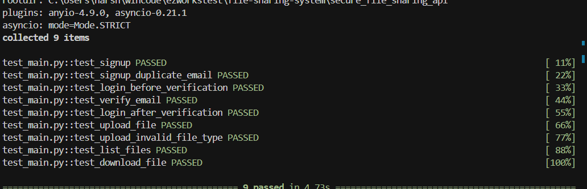

# Secure File Sharing System API

A secure API-based file sharing system built with FastAPI and MongoDB that enables operations users to upload files while allowing client users to securely download them.


<!-- 
To add the actual test pass image:
1. Run the tests with: pytest test_main.py -v
2. Take a screenshot of the passed tests
3. Save the screenshot as images/image.png 
-->

## Features

### Secure User Authentication
- JWT-based authentication
- Role-based access control (Operations User vs. Client User)
- Email verification for new accounts

### Role-Based Actions

#### Operations User
- Login with secure JWT authentication
- Upload files (restricted to .pptx, .docx, and .xlsx formats)

#### Client User
- Sign up (returns an encrypted verification URL)
- Email verification
- Login with secure JWT authentication
- List all uploaded files
- Generate secure download links for files

### Security Features
- Password hashing with bcrypt
- JWT-based authorization for all protected endpoints
- Secure, time-limited download links
- Download links can only be accessed by the client user who requested them
- Protection against unauthorized access

## Technical Stack

- **Framework**: FastAPI (Python)
- **Database**: MongoDB (NoSQL)
- **Authentication**: JWT (JSON Web Tokens)
- **Password Security**: Bcrypt
- **Testing**: Pytest, Pytest-asyncio

## API Endpoints

### Authentication Endpoints
- `POST /signup`: Register a new user (returns verification URL)
- `GET /verify-email/{token}`: Verify user's email address 
- `POST /login`: Authenticate a user and return an access token

### Operations User Endpoints
- `POST /upload`: Upload a file (pptx, docx, xlsx only)

### Client User Endpoints
- `GET /files`: List all available files
- `GET /download-file/{file_id}`: Generate a secure download link
- `GET /secure-download/{token}`: Download a file using a secure token

## Testing

The API is fully tested with pytest and pytest-asyncio. Tests cover:

- User registration flow
- Email verification process
- Authentication and authorization
- File upload restrictions
- Secure file download links
- Role-based access control

All tests pass successfully, ensuring the API meets all security and functionality requirements.

## Setup & Installation

1. Clone the repository
2. Install dependencies:
   ```bash
   pip install -r requirements.txt
   ```

3. Setup MongoDB:
   
   ### Option 1: Using Docker (Recommended)
   ```bash
   # Pull the MongoDB image
   docker pull mongo:latest
   
   # Run MongoDB container
   docker run -d -p 27017:27017 --name mongodb mongo:latest
   
   # To stop the container when done
   # docker stop mongodb
   ```
   
   ### Option 2: Install MongoDB locally
   Follow the [official MongoDB installation guide](https://docs.mongodb.com/manual/installation/)

4. Run the application:
   ```bash
   uvicorn main:app --reload
   ```

5. Run tests:
   ```bash
   pytest -v
   ```

## Security Considerations

- All passwords are securely hashed using bcrypt
- JWT tokens expire after a configurable time period
- File download links are temporary and secure
- Role-based permissions prevent unauthorized actions
- Email verification ensures account authenticity 